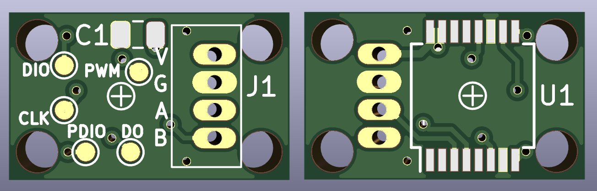

# AS5145B magnetic encoder board

This board includes an [AMS AS5145B](https://ams.com/as5145b) magnetic encoder for robotics projects.

## Description

The [AMS AS5145B](https://ams.com/as5145b) is a 12 bit programmable magnetic rotary encoder that provides multiple outputs SSI, PWM and quadrature. This board configures the encoder to provide quadrature A/B and Index output signals. It generates 1024 pulses per revolution and is ideal for different robotics projects.

The board includes a JST connector with 1.5 mm pitch with the following signals:

Signal | Description
-------|-------------
V | Power supply (3.3 V)
G | Ground
A | First quadrature channel
B | Second quadrature channel

## BOM

Reference | Description | Quantity
------------ | ------------- | ------------- |
AS5145B-HSST | AS5145B 12-Bit Programmable Magnetic Rotary Encoder | 1
C1 | 0805 ceramic capacitor, 100nF | 1
J1 | JST B4B-ZR | 1
